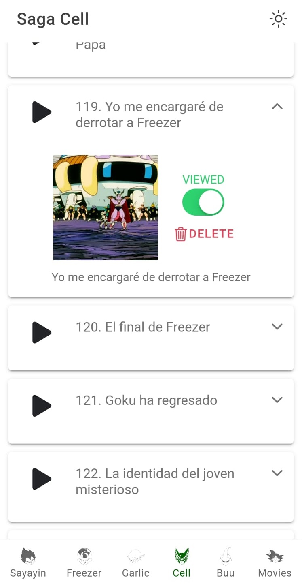
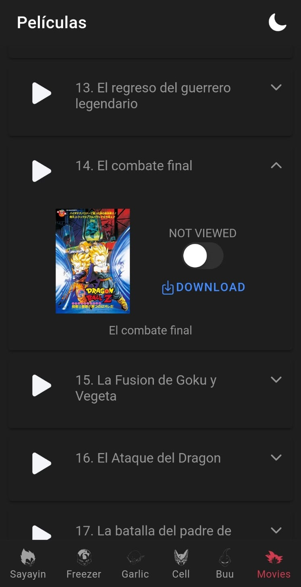

# DBZ LATINO - Ionic

<strong>DBZ LATINO</strong>
<i>is an open source mobile application that allows you to watch and download all dbz episodes and movies.</i>
 
Like other personal project, DBZ LATINO is free and open source. 
DBZ LATINO is available on the Google Play Store.

## About

DBZ LATINO is an open source mobile application. The application is using Ionic and Angular to allow you to access all the dbz episodes.

The main idea is to be able to see and download all the episodes and movies directly trough your phone.

***This project is intended for learning purposes only and is not associated in any way with the people in the images, nor with any organization affiliated with them.***.

## Features

This app lets you:
- Completely ad-free.
- Gives you access to all the dbz episodes and movies.
- Switch between dark and light themes.
- Possibility to download the videos for a better performance.
- Control the content already seen.
- Needs no special permissions on Android 6.0+.

## Screenshots

[View all screenshots](docs/readme.md)

## Current limitations

| OS | Status |
| -- | -- |
| Android | Tested and working on Android 9 |
| iOS | Not yet compatible |

## Development

### Requirements

- Node.js
- npm
- Angular - `npm install -g @angular/cli`
- IONIC - `npm install -g ionic`
- Capacitor - `npm install -g capacitor`

### Installation

1. Clone the repo
2. Run `npm install`
